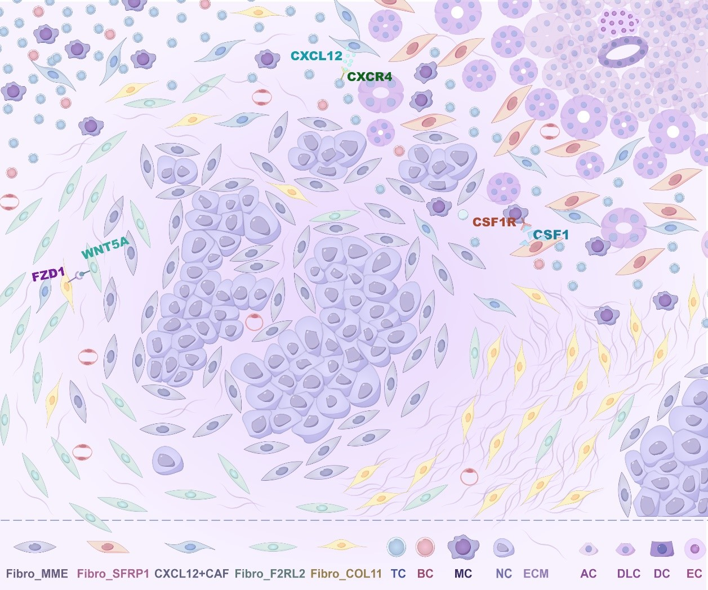

# PDAC analysis scripts

Scripts for PDAC Stereo-seq and scRNA-seq data analysis.

## Requirements
**Note**: The scripts in the repository have only been tested in a Linux system.
| Software | Version | Website |
| -------- | ------- | ------- |
| Python | 3.9.13 | https://www.python.org/ |
| R | 4.1.1 | https://www.r-project.org/ |
| STAR | 2.7.1a | https://github.com/alexdobin/STAR |
| PISA | 0.7-24 | https://github.com/shiquan/PISA |
| StereoCell | 1.0.6 | https://github.com/BGIResearch/StereoCell |
| Seurat | 3.1.2 | https://satijalab.org/seurat/ |
| RcppML | 0.5.6 | https://github.com/zdebruine/RcppML |
| cNMF | 1.4.1 | https://github.com/dylkot/cNMF |
| inferCNV | 1.12.0 | https://github.com/broadinstitute/infercnv |
| SAW | 5.1.3 | https://github.com/STOmics/SAW |
| Stereopy | 0.13.0b1 | https://github.com/STOmics/Stereopy |
| SPACEL | 1.1.6 | https://github.com/QuKunLab/SPACEL |
| scvi-tools | 0.20.3 | https://github.com/scverse/scvi-tools |
| Scanpy | 1.10.0 | https://github.com/scverse/scanpy |
| pySCENIC | 0.12.1 | https://github.com/aertslab/pySCENIC |
| Metascape | 3.5 | https://metascape.org/ |
| Squidpy | 1.2.3 | https://github.com/scverse/squidpy |
| Monocle 2 | 2.22.0 | http://cole-trapnell-lab.github.io/monocle-release |
| CellChat | 1.6.1 | https://github.com/sqjin/CellChat |
| NicheNetR | 2.0.2 | https://github.com/saeyslab/nichenetr |
| Cytoscape | 3.9.1 | https://cytoscape.org/ |
| NetworkX | 2.8.7 | https://networkx.org/ |
| Scipy | 1.11.1 | https://github.com/scipy/scipy |
| harmony | 0.0.9 | https://github.com/slowkow/harmonypy |
| ClusterGVis | 0.1.1 | https://github.com/junjunlab/ClusterGVis |
